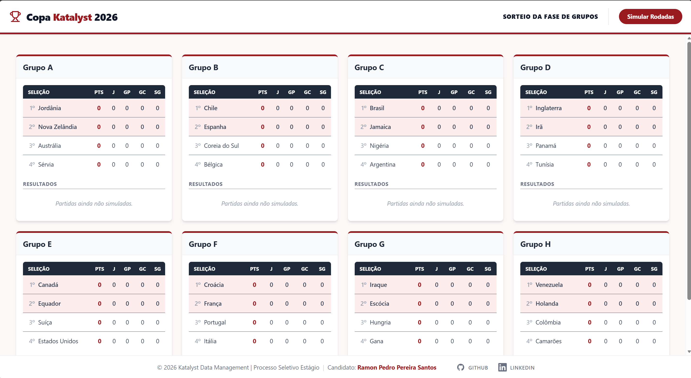
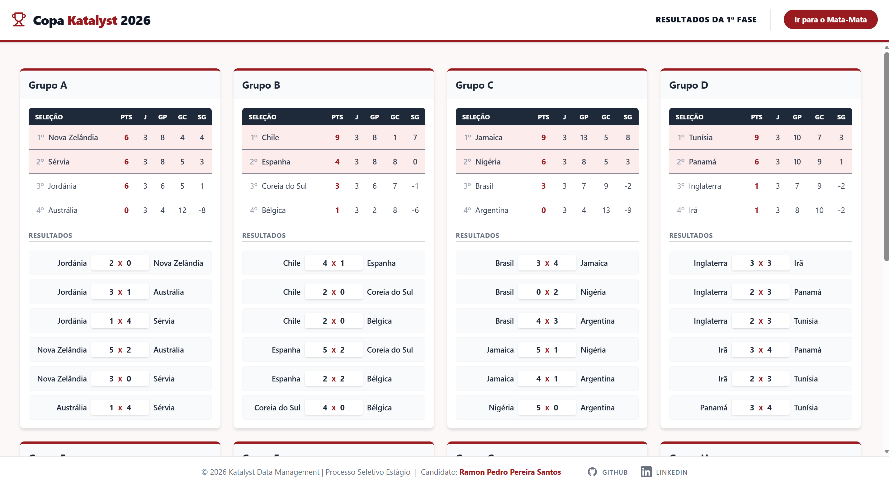
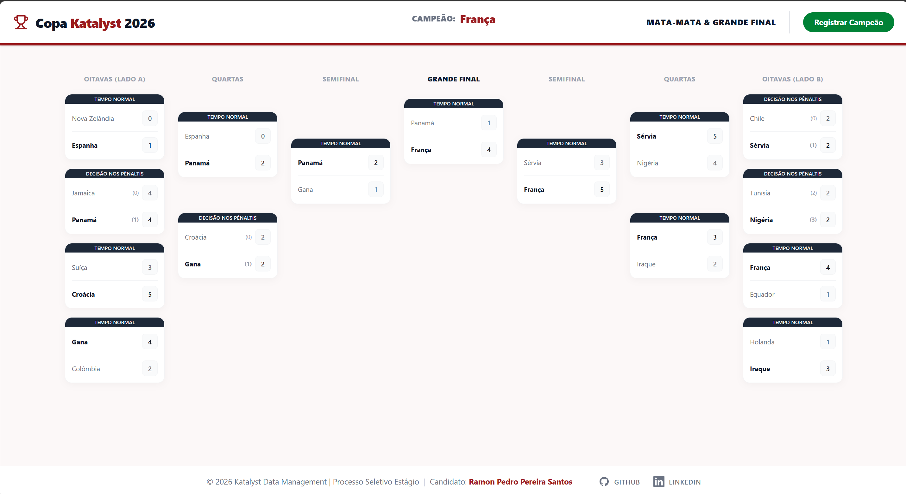

# Copa Katalyst 2026 - Simulation Dashboard

Este projeto é uma aplicação web desenvolvida como desafio técnico para o processo seletivo da **Katalyst Data Management**. O objetivo principal é simular o torneio da Copa do Mundo de 2026, desde o sorteio da fase de grupos até a consagração do campeão, com integração em tempo real com a API oficial do processo seletivo.

##  Interface Visual

Abaixo, os dois estados principais da aplicação:

| Fase de Grupos | Resultados | Campeao | 
| :---: | :---: | :---: |
|  |  |  | 

##  Funcionalidades Principais

- **Fluxo Automatizado:** Simulação completa do torneio, começando pelo sorteio dos grupos ao carregar a aplicação.
- **Fase de Grupos:**
  - Sorteio aleatório de 32 seleções em 8 grupos.
  - Cálculo de pontuação (Vitória/Empate/Derrota) e saldo de gols (SG).
  - Ordenação automática dos classificados para o mata-mata.
- **Mata-Mata (Knockout Stage):**
  - Chaveamento estruturado em formato de "pirâmide" (Oitavas até a Final).
  - Lógica de desempate via **pênaltis** implementada com interface visual.
  - Progressão dinâmica dos vencedores para as próximas fases.
- **Integração de API:**
  - Sincronização com a API `Katalyst World Cup` para registro do campeão.
  - Tratamento de erros e respostas não-JSON da API.
- **Interface UI/UX de Nível Sênior:**
  - Layout com Header e Footer fixos ("App View").
  - Design responsivo utilizando Tailwind CSS v4.
  - Indicador visual de campeão com animação no cabeçalho.
  - Layout de chaves em formato de pirâmide para melhor legibilidade.

##  Tecnologias Utilizadas

- **Frontend:** React (Vite) + TypeScript.
- **Estilização:** Tailwind CSS.
- **Gerenciamento de Estado:** Context API.

##  Estrutura do Projeto

- **/src/api:** Gerenciamento de chamadas HTTP (cliente robusto).
- **/src/components/brackets:** Lógica de renderização das chaves do torneio (pirâmide).
- **/src/components/groups:** Lógica de renderização e cálculo das tabelas de grupos.
- **/src/context:** Estado global da simulação.
- **/src/utils:** Funções de cálculo para desempates, geração de gols e sorteios.

